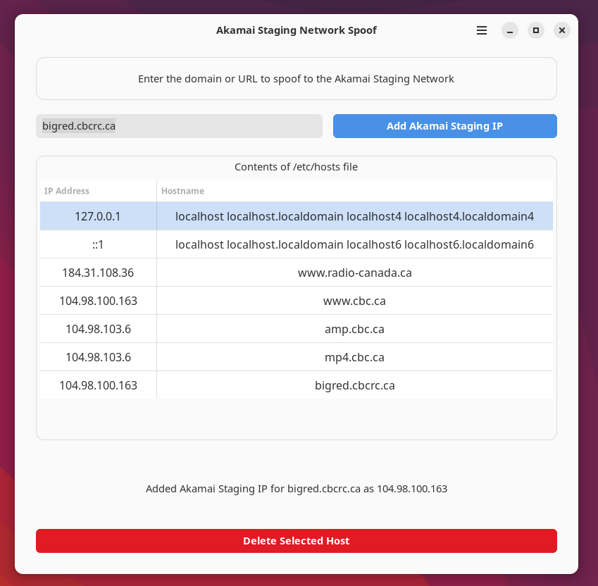
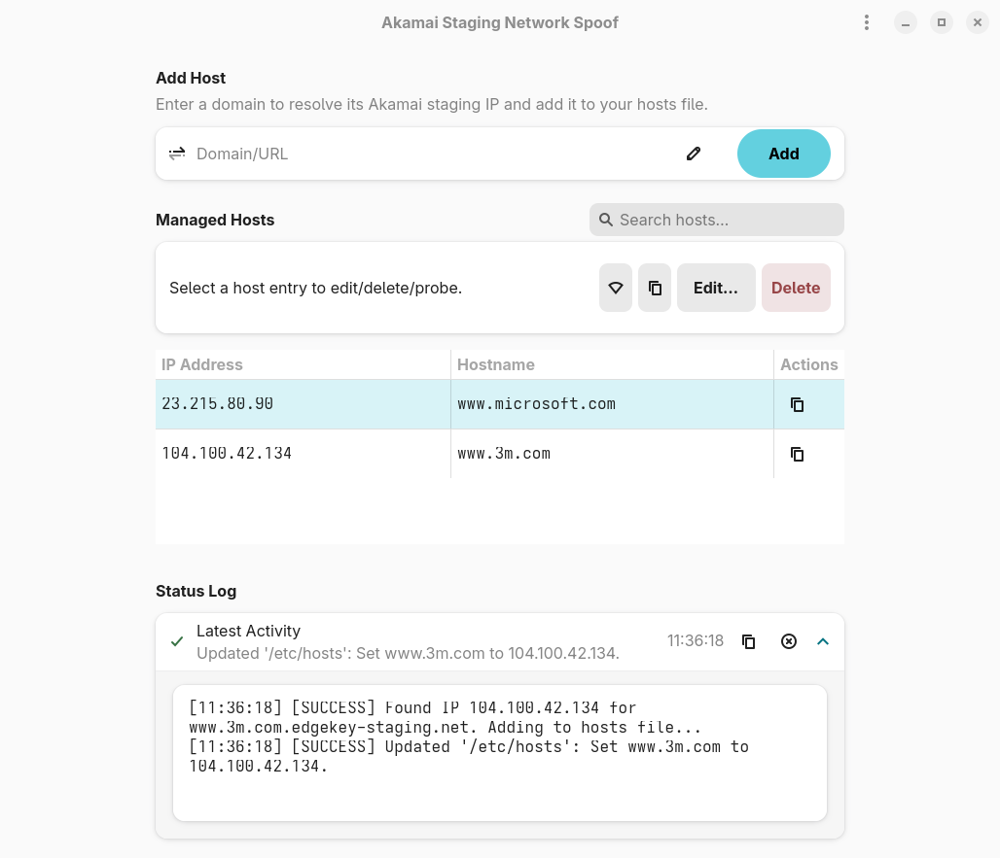

# AkamaiStaging



A Python-based GTK4 application for managing Akamai staging environments through simple DNS spoofing in your `/etc/hosts` file.

## Table of Contents

- [About](#about)
- [Features](#features)
- [Installation](#installation)
- [Usage](#usage)

## About

`AkamaiStaging` simplifies the process of testing your Akamai configuration changes and web applications against the Akamai staging network. It provides a graphical interface to add, update, and delete DNS entries in your `/etc/hosts` file, allowing you to direct specific domains to their corresponding Akamai staging IP.

## Features

- **Add Akamai Staging IPs:** Quickly add new entries to your `/etc/hosts` file to point domains to their staging environments.
- **Delete Hosts Entries:** Easily remove unwanted entries from the `/etc/hosts` file.
- **View Current Entries:** A clear list view displays the active entries in your `/etc/hosts` file.
- **Domain Validation:** Basic validation ensures that you enter valid domain.
- **Error Handling:** Provides informative messages in case of errors.
- **Customizable:** (Potentially) Add options for filtering or searching entries.

## Installation

You can try the `setup.py` script to install dependencies and build the application
if you're using macOS, Debian, Ubuntu, Fedora, CentOS, RHEL, or Arch.

The script has been tested on macOS and Fedora, so package names may be incorrect on other
platforms but I will try and address those when time permits. Please send me any bugs if
you run into any and I will fix them. This script hasn't been heavily tested, so I expect
some issues to crop up on other systems.

To install the dependencies, simply run:

```
./setup.py -i
```

and to build the project:

```
./setup.py -b
```

Once that is completed you should be able to run `/usr/local/bin/akamaistaging`.

If the setup script is failing, continue to see how to manually setup/build.

**Prerequisites:**

macOS, Linux, \*BSD requirements:

- `Python` 3.x & `pip`
- `Meson`
- Ninja
- `GTK4` Development Libraries (`libgtk-4-dev`, `gtk4-devel`, `gtk4` or equivalent to your OS)
- `libadwaita` 1.0 Development Libraries (`libadwaita-1-dev`, `libadwaita-devel`, `libadwaita` or equivalent to your OS)
- `desktop-file-utils`
- `python-dns`
- `pyobject3`
- `glib`

**Steps:**
On `macOS` with `Homebrew`:

Install platform dependencies:

```
> brew install meson meson-python ninja gtk4 libadwaita pkg-config desktop-file-utils python-dns pyobject3 glib
```

Get the code and build/install it (installs to /usr/local, and the akamaistaging script will be in /usr/local/bin)

```
> git clone https://github.com/mclellac/AkamaiStaging.git
> cd AkamaiStaging
> meson setup build && ninja -C build --verbose && sudo ninja -C build install --verbose
```

Run it:

```
> sudo /usr/local/bin/akamaistaging
```

## Usage

1. Launch the `AkamaiStaging` application.
2. Enter a domain name that has been CNAME'd to Akamai into the "Domain" field.
3. Click the "Add Akamai Staging IP" button.
4. The application will fetch the staging IP and add an entry to your `/etc/hosts` file.
5. The entry will be displayed in the tree view.
6. To remove an entry, select it in the tree view and click "Delete Selected Hosts Entry."

## Prefer dark? Here's how to enable it:



All you need to do is edit the akamaistaging file and uncomment the line:

```python
        #self.style_manager.set_color_scheme(Adw.ColorScheme.FORCE_DARK)
```

