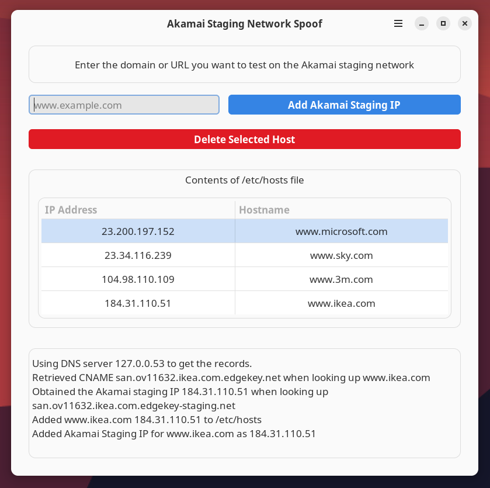

# Akamai Staging Network Spoof



A Python-based GTK4 application for managing Akamai staging environments through simple DNS spoofing in your `/etc/hosts` file.

## Table of Contents

- [About](#about)
- [Features](#features)
- [Installation](#installation)
- [Usage](#usage)

## About

The `Akamai Staging` application streamlines the process of testing website and application changes against Akamai's staging network. Before deploying new configurations or features to your live, Akamai-accelerated sites, it's crucial to verify them in a production-like environment. Akamai's staging network provides this, but directing your local machine to use it for a specific domain typically involves manual DNS lookups for staging IP addresses and modifications to your system's `/etc/hosts` file.

This tool automates and simplifies that workflow by:
- Taking a domain name as input.
- Performing the necessary DNS lookups to find its corresponding Akamai staging network IP address.
- Providing a graphical interface to easily add, update, or remove this IP-domain mapping in your `/etc/hosts` file.

By spoofing the domain to its staging IP in your local hosts file, your browser or application will connect to Akamai's staging environment when accessing that domain. This allows you to test your Akamai configurations (like caching rules, security policies, or edge logic) and application behavior as if it were live, but without impacting actual end-users. `Akamai Staging` makes this essential testing step more accessible and less error-prone.

## Features

- **Resolve and Add Akamai Staging IPs:** Enter a domain and the tool automatically discovers its Akamai staging IP address and adds the corresponding entry to your `/etc/hosts` file.
- **Delete Host Entries:** Easily remove entries from the `/etc/hosts` file.
- **Edit Existing Host Entries:** Modify the IP address or hostname(s) of existing entries.
- **View Current Host Entries:** Displays active, non-standard entries from your `/etc/hosts` file in a clear list (filters out common localhost, broadcast, and system entries).
- **Search/Filter Entries:** Quickly find specific entries in your hosts list.
- **Domain Sanitization:** Cleans up common prefixes (like `http://`) from input.
- **Error Handling:** Provides informative messages for DNS lookup issues, permission errors, etc.
- **Customization:** Includes options for font scaling and theme selection (Light/Dark/System) in Preferences.
- **Privilege Escalation:** Securely handles root/administrator privileges required for modifying the `/etc/hosts` file using OS-specific helper scripts (PolicyKit on Linux, osascript on macOS).

## Flatpak Limitations

*   **`/etc/hosts` Modification**: When installed as a Flatpak, Akamai Staging Tool currently **cannot** modify the system's `/etc/hosts` file. This is due to the sandboxing restrictions inherent in the Flatpak security model, which prevent direct modification of system-level files like `/etc/hosts`.
    *   Operations that require adding, removing, or editing hosts file entries will be disabled or will indicate this limitation within the Flatpak version.
    *   Future versions may explore using a Flatpak Portal or a privileged helper service to provide this functionality, but it is not currently implemented.
    *   For full functionality including `/etc/hosts` modification, please consider using a non-Flatpak installation method (e.g., installing from source or a native package if available).

## Installation

Building `Akamai Staging` from source is the primary installation method and uses the Meson build system.

### General Prerequisites

These are required for all operating systems (macOS, Linux, *BSD):

- **Python 3.x**: Ensure Python 3 is installed. `pip` (Python package installer) is usually included.
- **Meson Build System**: Version 0.60 or newer is recommended. ([Installation Guide](https://mesonbuild.com/Getting-meson.html))
- **Ninja**: A small build system with a focus on speed, used as the default backend for Meson. ([Installation Guide](https://ninja-build.org/))
- **dnspython**: Python DNS toolkit. Install via pip:
  ```bash
  pip install dnspython
  ```
- **PyGObject**: Python bindings for GObject libraries like GTK and GLib. Installation varies by OS (see below).

### OS-Specific Prerequisites

#### Linux (Debian/Ubuntu example)

- **GTK4 Development Libraries**:
  ```bash
  sudo apt install libgtk-4-dev
  ```
- **libadwaita Development Libraries**: (Version 1.0 or newer)
  ```bash
  sudo apt install libadwaita-1-dev
  ```
- **GLib Development Libraries & PyGObject**: These are often installed as part of GTK development packages or specifically for PyGObject. `libgirepository1.0-dev` provides GObject Introspection data.
  ```bash
  sudo apt install gobject-introspection libgirepository1.0-dev python3-gi python3-gi-cairo gir1.2-gtk-4.0 gir1.2-adw-1
  ```
- **desktop-file-utils**: For integrating the application into desktop environments.
  ```bash
  sudo apt install desktop-file-utils
  ```
*(Package names may vary for other distributions like Fedora, Arch, etc. Use your distribution's package manager to find equivalent packages for `gtk4`, `libadwaita`, `glib2`, `gobject-introspection`, and `python3-gobject`.)*

#### macOS (using Homebrew)

- **Core Build Tools & Libraries**:
  ```bash
  brew install meson ninja gtk4 libadwaita pkg-config
  ```
- **PyGObject**:
  ```bash
  brew install pygobject3
  ```
- **desktop-file-utils**: (Optional for macOS if not creating `.desktop` files for system integration, but good for consistency if scripts expect it)
  ```bash
  brew install desktop-file-utils
  ```
*(Note: `dnspython` is listed under General Prerequisites and should be installed via pip for consistency, though Homebrew might also offer a version.)*

### Building with Meson (Recommended)

1.  **Clone the repository:**
    ```bash
    git clone https://github.com/mclellac/AkamaiStaging.git
    cd AkamaiStaging
    ```

2.  **Set up the build directory:**
    Meson creates a separate build directory.
    ```bash
    meson setup build
    ```
    You can specify an installation prefix if you don't want to install to the default `/usr/local` (on Linux/macOS):
    ```bash
    meson setup build --prefix=~/.local
    ```

3.  **Compile the application:**
    ```bash
    ninja -C build
    ```
    *(If you prefer `make`, Meson can also generate Makefiles, but Ninja is standard.)*

4.  **Install the application:**
    ```bash
    sudo ninja -C build install
    ```
    This command typically requires root privileges if installing to system-wide locations like `/usr/local`. If you used a local prefix (e.g., `~/.local`), you might not need `sudo`:
    ```bash
    ninja -C build install
    ```
    The application uses OS-specific helper scripts for privilege escalation at runtime when modifying the hosts file, so the main application itself doesn't need to run as root.

### Using `setup.py` (Convenience Wrapper - Deprecated)

A `setup.py` script is included for historical reasons and as a potential convenience wrapper. However, **direct Meson usage (as described above) is strongly recommended** for better control and reliability. The `setup.py` script might not correctly handle dependencies on all systems.

If you choose to use it:
- To attempt installing dependencies (may only work on some Linux distributions):
  ```bash
  ./setup.py -i
  ```
- To build the project (this essentially runs the Meson commands for you):
  ```bash
  ./setup.py -b
  ```
If `setup.py` fails, please use the manual Meson build instructions.

### Running the Application

After installation, you should be able to run the application from your terminal:
```bash
akamaistaging
```
(Or `/usr/local/bin/akamaistaging` if `/usr/local/bin` is not in your PATH by default).

## Usage

1.  **Launch AkamaiStaging:** Open the application from your system's application menu or by running `akamaistaging` in the terminal.
2.  **Enter Domain:** In the "Domain to Add" field, type or paste the production domain name for which you want to access the Akamai staging environment (e.g., `www.example.com`). This domain should typically be CNAME'd to an Akamai edge hostname in its production DNS configuration.
3.  **Add to Hosts:** Click the "Get Staging IP & Add to Hosts" button.
    - The application will perform DNS lookups to find the specific Akamai staging IP address for your entered domain.
    - It will then attempt to add (or update) an entry in your system's `/etc/hosts` file, mapping the domain to this staging IP. This step will usually require administrator/root privileges, and the application will prompt you for credentials via a system dialog (e.g., PolicyKit or macOS security prompt).
4.  **Verify Entry:** The main list view will refresh, showing the newly added or updated entry along with other custom entries from your hosts file.
5.  **Test in Browser:** Open a web browser and navigate to the domain you added (e.g., `http://www.example.com` or `https://www.example.com`). Your local machine will now resolve this domain to the Akamai staging IP, allowing you to test your site's staging version.
6.  **Edit Entry (Optional):** Select an entry in the list and click the "Edit" button (pencil icon) to modify its IP address or hostname.
7.  **Delete Entry:** To remove an entry and restore normal DNS resolution for that domain on your machine, select it in the list view and click the "Delete" button (trash icon). This will also require administrator/root privileges.
8.  **Search/Filter:** Use the search bar at the top of the hosts list to quickly find entries by IP or hostname.
9.  **Status Messages:** Check the text area at the bottom of the window for status messages, errors, or confirmation of actions.

